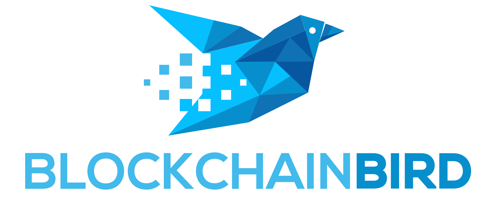

Blockchain Commons is proudly a "not-for-profit" social benefit corporation committed to open infrastructure.  Our goal to create low-cost, best-quality, proven infrastructure that is decentralized, platform-neutral, blockchain-neutral, and vendor-independent. We have a strong commitment to open source and a defensive patent strategy: anyone can use or improve our tools, and no one can take them away, allowing companies and individuals to bring complete solutions to market while staying focused on what makes their own business or project unique.

## News

* **1/6:** [Q4 Blockchain Commons Report](https://www.blockchaincommons.com/quarterlies/2020-Q4-Report/)
* **12/8:** [Blockchain Commons' URs Support Airgapped PSBTs & More](https://www.blockchaincommons.com/projects/Blockchain-Commons-URs-Support-Airgapped-PSBTs/)
* **11/10:** [Blockchain Commons Joins COPA](https://www.blockchaincommons.com/partnerships/BCC-Joins-COPA/)
* **10/30:** [Learning Bitcoin Upgrades to v2](https://www.blockchaincommons.com/projects/Learning-Bitcoin-Upgrades-to-v2/)
* **10/28:** [Blockchain Commons Releases Feature-complete LetheKit](https://www.blockchaincommons.com/projects/Releasing-LetheKit/)

## Projects

Our current projects include:

* [Gordian Products & Technologies](https://github.com/BlockchainCommons/Gordian) — integrated wallet and node technology that creates a self-sovereign infrastructure for Bitcoin  using Tor and QuickConnect.
* [Learning Bitcoin from the Command Line](https://github.com/BlockchainCommons/Learning-Bitcoin-from-the-Command-Line) — tutorials on programming with bitcoin-cli, lightning-cli, and RPC.
* [#SmartCustody](https://www.smartcustody.com/) — documents and tools to better secure your digital assets.
* [#LetheKit](https://github.com/BlockchainCommons/bc-lethekit) — DIY hardware box and SDK for airgapped cryptography and offline master-key management.
* [#Seedtool-cli](https://github.com/BlockchainCommons/bc-seedtool-cli) — cross-platform command-line C-based implementation for safe master key generation with support of BIP39 and SLIP39.
* [Spotbit](https://github.com/BlockchainCommons/spotbit) — self-sovereign cryptocurrency price discovery tool.
* Cryptographic Libraries — C-based implementations of [BIP39](https://github.com/BlockchainCommons/bc-bip39), [Shamir Secret Sharing](https://github.com/BlockchainCommons/bc-shamir), [SLIP39](https://github.com/BlockchainCommons/bc-slip39), and more.

We also offer services to the community improve the security of the web's open infrastructure.

* Security Reviews — risk-based assessments of custody methodologies, operational security procedures, and layer-2 protocols such as payment channels.
* Infrastructure — support of Tor exit nodes and other blockchain infrastructure & software.
* Project Support — contractual support of our open source projects such as GordianWallet-iOS, GordianServer-MacOS, and #LetheKit.

These are just the beginning! Blockchain Commons is also working on other cryptographic research, cryptographic & privacy protocol implementations, architecture & code reviews, industry standards, and documentation, including identity wallets, social-recovery techniques, zero-knowledge curve-operation proofs, advanced cryptographic primitives such as Schnorr, MuSig, and scriptless scripts, and in general establishing multi- and cross-blockchain standards.

If you support the goals and projects of Blockchain Commons, please consider becoming a [Sponsor](https://www.blockchaincommons.com/sponsors.html).

## More Info

For more information, see our [Posts](https://www.blockchaincommons.com/posts/) and [GitHub](https://github.com/BlockchainCommons), including the following discussions areas:
* [Gordian System Discussions](https://github.com/BlockchainCommons/Gordian/discussions) — for users and developers of the Gordian system, including the Gordian Server, Bitcoin Standup technology, QuickConnect, and the Gordian Wallet. If you want to talk about our linked full-node and wallet technology, suggest new additions to our Bitcoin Standup standards, or discuss the implementation our standalone wallet, the Discussions area of the [main Gordian repo](https://github.com/BlockchainCommons/Gordian) is the place.
* [Wallet Standard Discussions](https://github.com/BlockchainCommons/AirgappedSigning/discussions) — for standards and open-source developers who want to talk about wallet standards, please use the Discussions area of the [Airgapped Signing repo](https://github.com/BlockchainCommons/AirgappedSigning). This is where you can talk about projects like our [LetheKit](https://github.com/BlockchainCommons/bc-lethekit) and command line tools such as [seedtool](https://github.com/BlockchainCommons/bc-seedtool-cli), both of which are intended to testbed wallet technologies, plus the libraries that we've built to support your own deployment of wallet technology such as [bc-bip39](https://github.com/BlockchainCommons/bc-bip39), [bc-slip39](https://github.com/BlockchainCommons/bc-slip39), [bc-shamir](https://github.com/BlockchainCommons/bc-shamir), [Shamir Secret Key Recovery](https://github.com/BlockchainCommons/bc-sskr), [bc-ur](https://github.com/BlockchainCommons/bc-ur), and the [bc-crypto-base](https://github.com/BlockchainCommons/bc-crypto-base). If it's a wallet-focused technology or a more general discussion of wallet standards,discuss it here.
* [Blockchain Commons Discussions](https://github.com/BlockchainCommons/Community/discussions) — for developers, interns, and patrons of Blockchain Commons, please use the discussions area of the [Community repo](https://github.com/BlockchainCommons/Community) to talk about general Blockchain Commons issues, the intern program, or topics other than the [Gordian System](https://github.com/BlockchainCommons/Gordian/discussions) or the [wallet standards](https://github.com/BlockchainCommons/AirgappedSigning/discussions), each of which have their own discussion areas.

## Sustaining Sponsors

Thank you to the following sponsors who have become [sustaining sponsors](https://github.com/sponsors/BlockchainCommons) of Blockchain Commons.
  

 [*Learn more about them.*](sponsors)

Please support Blockchain Commons by becoming a [sustaining sponsor](https://github.com/sponsors/BlockchainCommons) or making a [BTCPay donation](https://btcpay.blockchaincommons.com/).

## Organization Membership

We are a member of [COPA](https://open-patent.org/)  , the Crypto Open Patent Alliance. We believe in open software and open access to patents covering foundational cryptocurrency techniques.

  

