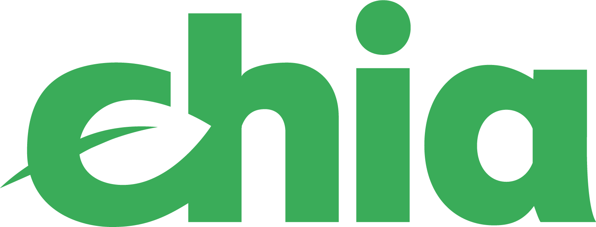

**Blockchain Commons advocates for human dignity online by enabling people to control their own digital destiny.**

Blockchain Commons works with developer communities to design, build, and maintain secure & compassionate decentralized architectures & tools for digital assets & digital identity based on responsible key management; based on our [Gordian Principles](https://github.com/BlockchainCommons/Gordian#gordian-principles) of independence, privacy, resilience, and openness; and based on our [Self-Sovereign Identity Principles](https://github.com/WebOfTrustInfo/self-sovereign-identity/blob/master/self-sovereign-identity-principles.md). Our goal is to reclaim human dignity & authority in the digital world. We also strive to educate & grow the blockchain community through online courses and our work with legislators and regulators.

Blockchain Commons is proudly a “not-for-profit” social benefit corporation, domiciled in Wyoming but operating world-wide. We have a strong commitment to open source and a defensive patent strategy: anyone can use or improve our tools, and no one can take them away. 

_Read more about Blockchain Commons' [vision & objectives](vision.md)._

## News

* **8/16/22:** [Private Key Disclosure: A Needless Threat to Rights and Assets](https://www.blockchaincommons.com/articles/Private-Key-Disclosure/)
* **7/19/22:** [Seven Years Later: DIDs Have Been Ratified](https://www.blockchaincommons.com/specifications/DIDs-Ratified/)
* **7/14/22:** [Q2, 2022 Blockchain Commons Report](https://www.blockchaincommons.com/quarterlies/Q2-2022/)
* **6/7/22:** [Silicon Salon a Success!](https://www.blockchaincommons.com/salons/silicon-salon-posted/)

_[Complete Posts Archive](https://www.blockchaincommons.com/posts/)._

## Projects

Our current projects include:

* [Gordian Products & Technologies](https://github.com/BlockchainCommons/Gordian) — reference apps that demonstrate the [Gordian Principles](https://github.com/BlockchainCommons/Gordian#gordian-principles).
   * [Gordian Seed Tool](https://github.com/BlockchainCommons/GordianSeedTool-iOS) — our premiere reference app, demonstrating how to closely hold a seed and still use it for active management of keys.
* Web demos — demonstrations of specs and apps such as [Lifehash](https://lifehash.info/) and [Seedtool](https://seedtool.info/).
* [Research](https://github.com/BlockchainCommons/Research) — Technical descriptions and docs for our interoperable and open infrastructural and architectural specifications, such as [Uniform Resources (URs)](https://github.com/BlockchainCommons/crypto-commons/blob/master/Docs/ur-1-overview.md), [Sharded Secret Key Reconstruction (SSKR)](https://github.com/BlockchainCommons/crypto-commons/blob/master/Docs/sskr-developers.md), [Bytewords](https://github.com/BlockchainCommons/Research/blob/master/papers/bcr-2020-012-bytewords.md), and [Lifehash](https://github.com/BlockchainCommons/lifehash.info).
* [Crypto Commons Libraries](https://github.com/BlockchainCommons/crypto-commons) — reference libraries providing access to interoperable and open infrastructural and architectural specifications, including [Shamir's Secret Sharing](https://github.com/BlockchainCommons/bc-shamir), [Sharded Secret Key Reconstruction (SSKR)](https://github.com/BlockchainCommons/bc-sskr), [Uniform Resources (URs)](https://github.com/BlockchainCommons/bc-ur), [Lifehash](https://github.com/BlockchainCommons/bc-lifehash), [Bytewords](https://github.com/BlockchainCommons/bc-bytewords), and more.
* [Learning Bitcoin from the Command Line](https://github.com/BlockchainCommons/Learning-Bitcoin-from-the-Command-Line) — our educational course introducing blockchains and Bitcoin development.
* [#SmartCustody](https://www.smartcustody.com/) — our educational course laying out the foundation of responsible key management.
* [**Non-partisan Advocacy**](https://github.com/BlockchainCommons/Testimony/blob/master/README.md) — promotion of legislation protecting technology & digital civil rights to ensure secure & compassionate digital infrastructure.

This video overviews many of our specifications and other initiatives:

<iframe width="400" height="225" src="https://www.youtube.com/embed/RYgOFSdUqWY" title="YouTube video player" frameborder="0" allow="accelerometer; autoplay; clipboard-write; encrypted-media; gyroscope; picture-in-picture" allowfullscreen></iframe>

We also offer services to the improve the security and infrastructure of the larger blockchain ecosystem:

* Infrastructure — support of Tor exit nodes and other blockchain infrastructure & software.
* Security Reviews — risk-based assessments of custody methodologies, operational security procedures, and layer-2 protocols such as payment channels.
* Project Support — contractual support of our open-source projects such as Gordian Seed Tool and for our specs and libraries.

If you are interested in working with us directly on a Security Review or Support for using a project with your business, please [contact us](mailto:team@blockchaincommons.com).

These are just the beginning! Blockchain Commons is also working on other cryptographic research, cryptographic & privacy protocol implementations, architecture & code reviews, industry standards, and documentation. Our more future-looking research includes work on identity wallets, social-recovery techniques, zero-knowledge curve-operation proofs, advanced cryptographic primitives such as Schnorr, MuSig, and scriptless scripts, and in general establishing multi- and cross-blockchain standards.

If you support the goals and projects of Blockchain Commons, please consider becoming a [Sponsor](https://www.blockchaincommons.com/sponsors.html).

## More Info

For more information, see our [Posts](https://www.blockchaincommons.com/posts/) and [GitHub](https://github.com/BlockchainCommons), including the following discussions areas:
* [Wallet Standard Discussions](https://github.com/BlockchainCommons/AirgappedSigning/discussions) — for standards and open-source developers who want to talk about wallet standards, please use the Discussions area of the [Airgapped Signing repo](https://github.com/BlockchainCommons/AirgappedSigning). This is where you can talk about our specifications, our reference libraries, and our reference apps — including discussions of how to continue to improve the interoperability of the field.
* [Gordian System Discussions](https://github.com/BlockchainCommons/Gordian/discussions) — for users and developers of the Gordian system, including Gordian Seed Tool, the Gordian Server, Bitcoin Standup technology, QuickConnect, and the Gordian Wallet. If you want to talk about our linked full-node and wallet technology, discuss our airgapped apps, suggest new additions to our Bitcoin Standup standards, or discuss the implementation our standalone wallet, the Discussions area of the [main Gordian repo](https://github.com/BlockchainCommons/Gordian) is the place.
* [Blockchain Commons Discussions](https://github.com/BlockchainCommons/Community/discussions) — for developers, interns, and patrons of Blockchain Commons, please use the discussions area of the [Community repo](https://github.com/BlockchainCommons/Community) to talk about general Blockchain Commons issues, the intern program, or topics other than the [Gordian System](https://github.com/BlockchainCommons/Gordian/discussions) or the [wallet standards](https://github.com/BlockchainCommons/AirgappedSigning/discussions), each of which have their own discussion areas.

## Sustaining Sponsors

Thank you to the following sponsors who have become [sustaining sponsors](https://github.com/sponsors/BlockchainCommons) of Blockchain Commons.
  

 [*Learn more about them.*](sponsors)

Please support Blockchain Commons by becoming a [GitHub sponsor](https://github.com/sponsors/BlockchainCommons) or making a [BTCPay donation](https://btcpay.blockchaincommons.com/).

## Organization Membership

We are a member of [COPA](https://open-patent.org/) , the Crypto Open Patent Alliance. We believe in open software and open access to patents covering foundational cryptocurrency techniques.

  

