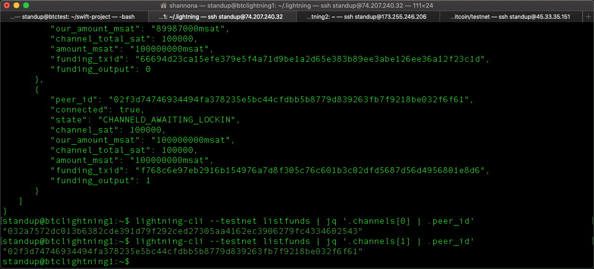
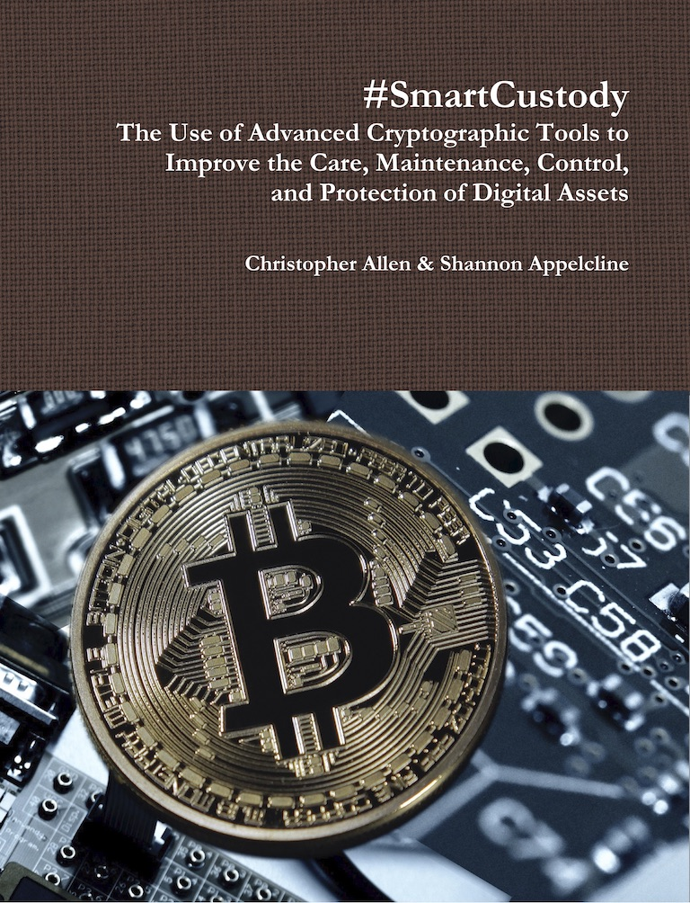
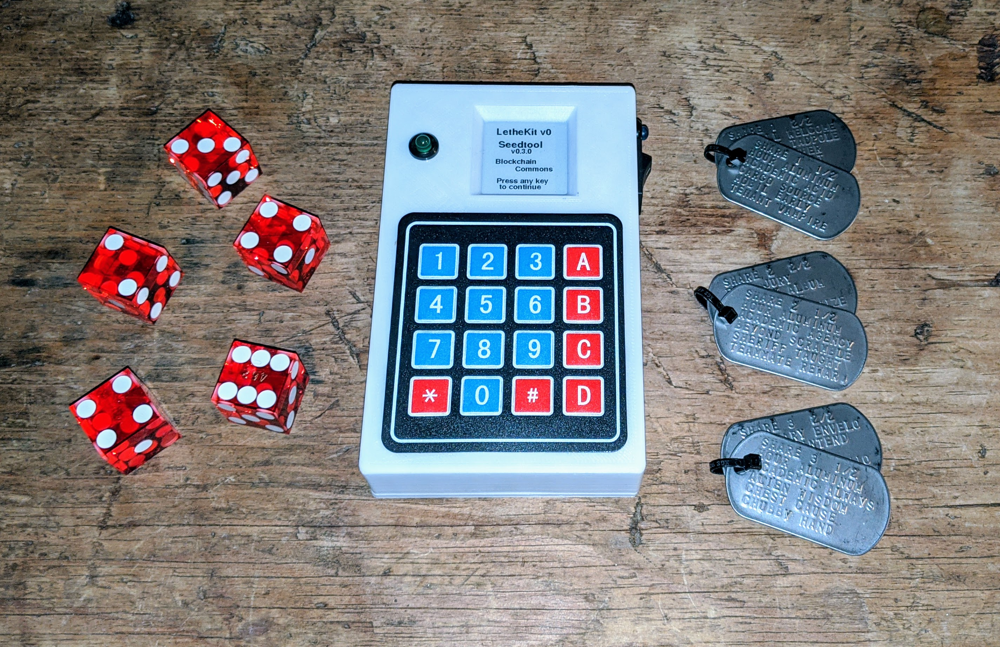
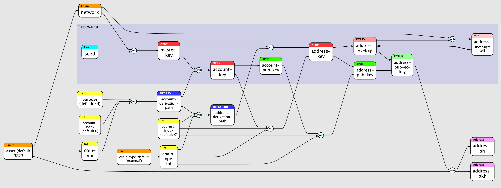

Blockchain Commons is working on a large variety of projects all intended to improve the entirety of the community who is using blockchain technology and developing it.

## Contents

- [Educational Projects](#educational-projects)
  * [Learning Bitcoin from the Command Line](#learning-bitcoin-from-the-command-line)
  * [#SmartCustody](#-smartcustody)
- [Architectures & Specifications](#architectures---specifications)
  * [Gordian Architecture](#gordian-architecture)
  * [Torgap Architecture](#torgap-architecture)
  * [Research Papers](#research-papers)
  * [Lifehash Specification](#lifehash-specification)
  * [SSKR Specification](#sskr-specification)
  * [Uniform Resource (UR) Specification](#uniform-resource--ur--specification)
- [Gordian Reference Projects](#gordian-reference-projects)
  * [The Core Gordian System (web + iOS)](#the-core-gordian-system--web---ios-)
  * [Gordian Seed Tool (iOS)](#gordian-seed-tool--ios-)
  * [Gordian QR Tool (iOS)](#gordian-qr-tool--ios-)
  * [Gordian Cosigner (Android, iOS, MacOS)](#gordian-cosigner--android--ios--macos-)
  * [Gordian Server (MacOS)](#gordian-server--macos-)
  * [LetheKit (kit)](#lethekit--kit-)
  * [Mori-CLI](#mori-cli)
  * [Spotbit (web)](#spotbit--web-)
  * [Sweeptool-CLI](#sweeptool-cli)
- [Other Developer Projects](#other-developer-projects)
  * [C Libraries](#c-libraries)
  * [Bytewords-CLI](#bytewords-cli)
  * [Keytool-CLI](#keytool-cli)
  * [LifeHashTool-CLI](#lifehashtool-cli)
  * [Musign-CLI](#musign-cli)
  * [Seedtool-CLI](#seedtool-cli)
  * [UR Demo](#ur-demo)
- [Open Infrastructure Projects](#open-infrastructure-projects)
  * [Spotbit Server](#spotbit-server)
  * [Testnet Public Node](#testnet-public-node)
  * [Tor Exit Node](#tor-exit-node)

<small><i><a href='http://ecotrust-canada.github.io/markdown-toc/'>Table of contents generated with markdown-toc</a></i></small>

## Educational Projects

_Educational projects consist of books, tutorials, or courses, intended to teach the usage of blockchains to programmers and end users alike._

### Learning Bitcoin from the Command Line

**Repo:** [Learning-Bitcoin-from-the-Command-Line](https://github.com/BlockchainCommons/Learning-Bitcoin-from-the-Command-Line) 
**Status:** v2.1 Complete (2021-10-06) 
**Future:** [Topics for v3.0](https://github.com/BlockchainCommons/Learning-Bitcoin-from-the-Command-Line/blob/master/TODO-30.md) 
**Blog:** [Learning Bitcoin Upgrades to v2](https://www.blockchaincommons.com/projects/Learning-Bitcoin-Upgrades-to-v2/) (10/30/20)

This is a complete twenty-chapter course intended to teach system administrators, developers, and engineers who are already acquainted with the UNIX command line interface how to work with Bitcoin. It uses this methodology to teach the fundamentals of Bitcoin, from RPC communications to how transactions work and how scripts work. The majority of the course is focused on `bitcoin-cli`, but there's also information on scripting, on programming with the RPC interface, and on using other command-line programs, beginning with `lightning-cli`. Translations are now available for [Portuguese](https://github.com/BlockchainCommons/Learning-Bitcoin-from-the-Command-Line/blob/master/pt/README.md), with the final iteration of [Spanish](https://github.com/BlockchainCommons/Learning-Bitcoin-from-the-Command-Line/tree/spanish-translation/es) pending.

### #SmartCustody

  
**PDF:** [#SC v1.01](https://bit.ly/SmartCustodyBookV101) 
**Book Site:** [WWW Site](https://www.smartcustody.com/)
**New Technologies:** [Articles](https://github.com/BlockchainCommons/SmartCustody#smartcustody-tools)
**Case Studies:** [Overview](https://github.com/BlockchainCommons/SmartCustody/blob/master/Docs/Case-Studies-Overview.md)
**Repo:** [SmartCustody Repo](https://github.com/BlockchainCommons/SmartCustody), [SmartCustodyBook](https://github.com/BlockchainCommons/SmartCustodyBook) 
**Status:** v1.01 Complete (2019-09-16) 
**Future:** [Outline for v2.0](https://github.com/BlockchainCommons/SmartCustodyBook/blob/master/TODO.md) 
**Blog:** [June TweetStorms on #SmartCustody Adversaries, 1-on-1 Advice, Supporting Smart Custody Book v2](https://www.smartcustody.com/2020-06-03-June-Tweetstorm/) (6/3/20)

_The Use of Advanced Cryptographic Tools to Improve the Care, Maintenance, Control, and Protection of Digital Assets._ This five-chapter (186-page) book is intended to make you rethink the security of your digital assets. It puts together a risk-modeling system with two additional building blocks: a cold-storage scenario for managing self-custody; and an extensively detailed list of potential adversaries. By working through the book, you can determine which adversaries are actually the most dangerous to your assets, and adjust your own self-custody scenario to accomodate them. Additional chapters talk about fiduciary duties with regard to digital assets. 

A v2.0 of this book is in the planning stage, to improve the accessibility of the course, to support additional hardware tools, and to introduce multi-signature scenarios. Our [multisig design article](https://github.com/BlockchainCommons/Gordian/blob/master/Docs/Multisig.md), our [sharding design article](https://github.com/BlockchainCommons/SmartCustody/blob/master/Docs/SSKR-Sharing.md), and our [Timelock exploration article](https://github.com/BlockchainCommons/SmartCustody/blob/master/Docs/Timelocks.md) are our first content for that update.

## Architectures & Specifications

_The core of Blockchain Commons' work is the creation of specifications and architectures, in cooperation with the [Airgapped Wallet Community](https://github.com/BlockchainCommons/Airgapped-Wallet-Community/discussions). They're meant to create better interoperability in the blockchain ecosystem while also supporting the Gordian principles._

### Gordian Architecture

**Repo:** [Gordian](https://github.com/BlockchainCommons/Gordian) 
**More Info:** [Principles](https://github.com/BlockchainCommons/Gordian#gordian-principles), [Apps](https://github.com/BlockchainCommons/Gordian#quick-links-for-reference-apps)

The Gordian architecture calls for paritioned services, where apps and microservices work together in an interoperable ecosystem separated by [Torgaps](https://github.com/BlockchainCommons/torgap) and airgaps. The architecture is intended to support the Gordian principles of Independence, Privacy, Resilience, and Openness and also ensure the #SmartCustody of assets.

### Torgap Architecture

**Repo:** [Torgap](https://github.com/BlockchainCommons/torgap) 
**Projects:** [Demo](https://github.com/BlockchainCommons/torgap-demo), [torgap-sig](https://github.com/BlockchainCommons/torgap-sig), [torgap-sig-cli-rust](https://github.com/BlockchainCommons/torgap-sig-cli-rust), [torgap-timestamps](https://github.com/BlockchainCommons/torgap-opentimestamps/blob/master/README.md)

Torgap is an element of the Gordian Architecture that ensures that apps and microservices that are connected through internet links do so through Tor, ensuring the partitioning of the services and also supporting the privacy of the user.

### Research Papers

**Repo:** [Research](https://github.com/BlockchainCommons/Research) 
**Video:** [Overview](https://www.youtube.com/watch?v=RYgOFSdUqWY)

Much of Blockchain Commons' work on specifications begins with Research papers, which describe and detail the use of a new, interoperable specification for blockchain and Bitcoin.

### Lifehash Specification

**Repo:** [C/C++ Library](https://github.com/BlockchainCommons/bc-lifehash), [Swift Library](https://github.com/BlockchainCommons/LifeHash), [Web Demo](https://github.com/BlockchainCommons/lifehash-web) 
**Video:** [Explainer Video](https://www.youtube.com/watch?v=cu0K__KLxKo)

LifeHash is a method of hash visualization based on Conway's Game of Life that creates beautiful icons that are deterministic, yet distinct and unique given the input data. The basic concept is to take a SHA256 hash of the input data (which can be any data including another hash) and then use the 256-bit digest as a 16x16 pixel "seed" for running Conway’s Game of Life.

LifeHash is used by Blockchain Commons to create distinct and unique visual representations for your seeds and keys, so that you can recognize them at a glance.

### SSKR Specification

**Paper:** [UR Type Definition for Sharded Secret Key Reconstruction (SSKR)](https://github.com/BlockchainCommons/Research/blob/master/papers/bcr-2020-011-sskr.md) 
**Libraries:** [C library](https://github.com/BlockchainCommons/bc-sskr) 
**Security Review:** [2021 Review](https://github.com/BlockchainCommons/bc-sskr/blob/master/SECURITY-REVIEW.md) 
**Documents:** [SSKR Overview](https://github.com/BlockchainCommons/crypto-commons/blob/master/Docs/sskr-overview.md), [SSKR Share Scenarios](https://github.com/BlockchainCommons/SmartCustody/blob/master/Docs/SSKR-Sharing.md), [SSKR Dangers](https://github.com/BlockchainCommons/SmartCustody/blob/master/Docs/SSKR-Dangers.md)

Blockchain Commons SSKR is an implementation of Sharded Secret Key Reconstruction (SSKR) for use in Blockchain Commons Software Projects. It currently implements Shamir's Secret Sharing, allowing for sharding and reconstruction of a key, to improve Resilience.

### Uniform Resource (UR) Specification

**Papers:** [Uniform Resources (URs)](https://github.com/BlockchainCommons/Research/blob/master/papers/bcr-2020-005-ur.md), [Registry of UR Types](https://github.com/BlockchainCommons/Research/blob/master/papers/bcr-2020-006-urtypes.md), [UR Type Definitions for Transactions Between Airgapped Devices](https://github.com/BlockchainCommons/Research/blob/master/papers/bcr-2021-001-request.md), and others 
**Libraries:** [C++ library](https://github.com/BlockchainCommons/bc-ur), [Java library](https://github.com/BlockchainCommons/bc-ur-java) 
**Documents:** [UR Overview](https://github.com/BlockchainCommons/crypto-commons/blob/master/Docs/ur-overview.md), [UR Introduction](https://github.com/BlockchainCommons/crypto-commons/blob/master/Docs/ur-1-overview.md) 
**Blog:** [Blockchain Commons’ Uniform Resources (URs) Support Airgapped PSBTs & More](https://www.blockchaincommons.com/projects/Blockchain-Commons-URs-Support-Airgapped-PSBTs/) (12/8/20)

UR stands for Uniform Resources, a method for encoding structured binary data in plain-text strings that are also well-formed URIs. It's an interoperability specification that allows for the reliable, typed transfer of data and was designed in particular to allow for reliable transmission of crypto-seeds, crypto-keys, PSBTs, and other data related to cryptocurrency.

One of the particular advantages of UR is careful integration with QR codes, a prime method for transmitting data across airgaps. URs are built to be efficient when encoded as QRs. In addition, multi-part URs allow for the creation of animated QRs, overall containing more information than any single QR could have.

## Gordian Reference Projects

_Reference projects demonstrate the self-sovereign approach of the Gordian principles, highlighting Independence, Privacy, Resilience, and Openness, and display the use of the Blockchain Commons specifications._

### The Core Gordian System (web + iOS)

**Repo:** [Gordian](https://github.com/BlockchainCommons/Gordian) 
**Status:** Varied

The Gordian system is a suite of powerful open-source reference apps that demonstrate the [Gordian Principles](https://github.com/BlockchainCommons/Gordian#gordian-principles) using Airgaps and [Torgaps](https://github.com/BlockchainCommons/torgap). The most developed releases are mobile apps such as [Gordian Seed Tool](https://github.com/BlockchainCommons/GordianSeedTool-iOS), but a powerful Wallet/Server setup also demonstrates how to maintain self-sovereignty while connecting to the Bitcoin network.

### Gordian Seed Tool (iOS)

**Repo:** [Seed Tool](https://github.com/BlockchainCommons/GordianSeedTool-iOS) 
**Status:** [Apple App Store Release](https://apps.apple.com/us/app/gordian-seed-tool/id1545088229) 
**Blog:** [Gordian Seed Tool Reveals the Foundations of Cryptography](https://www.blockchaincommons.com/projects/SeedTool-Release/) (7/15/21)

Gordian Seed Tool is Blockchain Commons' most fully featured reference app. It protects your cryptographic seeds while also making them available for easy use. Using Seed Tool, you can generate seeds and store them securely on your device. You can then derive and share multi-signature signing and verification keys from those seeds or alternatively sign PSBTs directly from the app. Sophisticated backup procedures include printed pages and Sharded Secret Key Reconstruction ([SSKR](https://github.com/BlockchainCommons/crypto-commons/blob/master/Docs/README.md#sharded-secret-key-reconstruction-sskr)) — which lets you split your seed into pieces and send them to trusted parties, who can send them back to you in an emergency for seed recovery. You can even use an entirely offline device (no internet access) to store your seeds and use QR codes to exchange necessary information with online devices running compatible wallet or signing software. A complete [manual](https://github.com/BlockchainCommons/GordianSeedTool-iOS/blob/master/Docs/MANUAL.md) details its functionality.

### Gordian QR Tool (iOS)

**Repo:** [QR Tool](https://github.com/BlockchainCommons/GordianQRTool-iOS) 
**Status:** [Apple App Store Release](https://apps.apple.com/us/app/gordian-qr-tool/id1506851070) 
**Blog:** [Gordian QR Tool Supports Vaccine Records, 2FAs, Cryptoseeds, and More](https://www.blockchaincommons.com/projects/Releasing-QRTool/) (6/24/21)

Gordian QR Tool is a reference tool that acts as a secure place to store and backup sensitive data that is encoded into QRs. Powered by [Uniform Resource](https://github.com/BlockchainCommons/Research/blob/master/papers/bcr-2020-005-ur.md), it was built to store SSKRs, PSBTs, and seeds encoded using [URs](https://github.com/BlockchainCommons/Research/blob/master/papers/bcr-2020-005-ur.md), however it can also be used to store other sorts of sensitive data such as 2FAs and protects them using the Gordian Principles. Data is always stored with multiple layers of encryption using your device's keychain. A quick overview on using Gordian QR Tool is available in its [Manual](https://github.com/BlockchainCommons/GordianQRTool-iOS/blob/master/Docs/MANUAL.md).

### Gordian Cosigner (Android, iOS, MacOS)

**Repo:** [Cosigner iOS](https://github.com/BlockchainCommons/GordianCosigner-iOS), [Cosigner Android](https://github.com/BlockchainCommons/GordianSigner-Android), or [Cosigner macOS](https://github.com/BlockchainCommons/GordianSigner-macOS) 
**Status:** Varied

Gordian Cosigner allows users to participate in a multisig by adding a signature to an otherwise unsigned or partially signed PSBT that was created on another device. It's largely intended as an offline signing tool, which allows signing without a direct connection to a full node: a wallet that can create PSBTs or another transaction coordinator service is needed to initiate a transaction –– such as the [Gordian system.](https://github.com/BlockchainCommons/Gordian). Its functionality has been somewhat superceded by the PSBT signing functionality of Gordian SeedTool.

### Gordian Server (MacOS)

**Repo:** [Gordian Server](https://github.com/BlockchainCommons/GordianServer-macOS) 
**Status:** Feature-Complete

Gordian Serverinstalls a self-sovereign Bitcoin Core server, protected by Tor, on your Mac computer. This gives you complete control over your Bitcoin destiny, and supports easy connectivity with [Gordian Wallet](https://github.com/BlockchainCommons/GordianWallet-iOS), [Fully Noded](https://apps.apple.com/us/app/fully-noded/id1436425586), and other wallets that support the [QuickConnect API](https://github.com/BlockchainCommons/Gordian/blob/master/Docs/Quick-Connect-API.md).

### Gordian Wallet (iOS)

**Repo:** [Wallet](https://github.com/BlockchainCommons/GordianWallet-iOS) 
**Status:** Early Beta

Gordian Wallet demonstrates how to use the Torgapped Gordian architecture to connect a Wallet to a Bitcoin Core server such as **Gordian Server**, using the [QuickConnect API](https://github.com/BlockchainCommons/Gordian/blob/master/Docs/Quick-Connect-API.md). It allows for multiple wallet templates, many of them supporting #SmartCustody, including: legacy, SegWit-compatible, and SegWit-native hot wallets using a single signature (seed on iOS device); a warm wallet using multisig (seed on iOS device, keys on full node, offline seed, etc.); or a number of cold wallet templates that leverage PSBTs (Partially Signed Bitcoin Transactions), such as cold offline seeds, third-party collaborative custody services, and various air-gapped hardware solutions using QR codes. Gordian Wallet can potentially support almost anything that can be described by a bitcoind descriptor.  ([It's meant to cut through a traditionally knotty problem in Bitcoin development.](https://github.com/BlockchainCommons/Gordian/blob/master/Docs/Why-Gordian.md)) 

### LetheKit (kit)

**Repo:** [lethekit](https://github.com/BlockchainCommons/lethekit) 
**Status:** Late Alpha 
**Blog:** [Blockchain Commons Releases Feature-complete LetheKit](https://www.blockchaincommons.com/projects/Releasing-LetheKit/) (10/28/20)

LetheKit is a do-it-youself platform for performing various sensitive cryptographic operations on an offline airgapped device. It uses no WiFi or Bluetooth which could leak information and contains no local storage, and when the device is turned off it forgets any sensitive data stored in RAM. Thus the name Lethe (lee-thee), from the [mythological river](https://en.wikipedia.org/wiki/Lethe) of forgetfulness and oblivion.

### Mori-CLI

**Repo:** [Mori-CLI](https://github.com/BlockchainCommons/mori-cli)
**Status:** Late Alpha

Mori-CLI proposes a way that a Bitcoin owner can leave his digital assets to his heirs in the event of death, in a decentralized way and with the least possible complication. It is an experimental project meant to extend concepts of #SmartCustody to inheritance.

### Spotbit (web)

**Repo:** [spotbit](https://github.com/BlockchainCommons/spotbit) 
**Status:** Late Alpha

Spotbit is a portable Flask API for Bitcoin price data and candles. It can either be used as a repository of historical data that allows for more frequent API requests, or as a simple wrapper around exchange APIs that permits the user to collect information over Tor. It can aggregate data from over 100 exchanges and serve them from a single URL or using Tor as an onion hidden service. It's extremely flexible: the user can decide which base currencies to use (USDT, USD, EUR etc), which exchanges to keep data for, and how much data to keep.

### Sweeptool-CLI

**Repo:** [Sweeptool](https://github.com/BlockchainCommons/sweeptool-cli)
**Status:** Late Alpha

Sweeptool connects to an Electrum server hosted by Blockstream or a server of your choice (including Esplora or Electrum server via Tor onion address) and synchronizes the list of transactions received and available UTXOs. Based on this information sweeptool produces a PSBT which can be signed by an offline signing device or by the tool itself.

## Other Developer Projects

_Developer projects create resources for use by engineers and programmers, including libraries and CLIs, many of which embody the Blockchain Commons specifications. The [Crypto Commons repository](https://github.com/BlockchainCommons/crypto-commons) collects together all of Blockchain Commons' wallet libraries and the utilities (reference implementations) built from them, as well as demos and tools which exercise and exemplify those wallet libraries._

### C Libraries

**Repos:** [bc-crypto-base](https://github.com/BlockchainCommons/bc-crypto-base), [bc-shamir](https://github.com/blockchainCommons/bc-shamir/), [bc-sskr](https://github.com/BlockchainCommons/bc-sskr), [bc-bip39](https://github.com/BlockchainCommons/bc-bip39), [bc-ur](https://github.com/BlockchainCommons/bc-ur), and [bc-bytewords](https://github.com/BlockchainCommons/bc-bytewords) 
**Status:** Feature-complete beta

Blockchain Commons offers a variety of C-language cryptographic libraries focused largely on wallet design, which can be used in your own projects. The current libraries include 
reference implementations of [BIP39](https://github.com/BlockchainCommons/bc-bip39), [Shamir Secret Sharing](https://github.com/blockchainCommons/bc-shamir/), our [Shamir Secret Key Recovery (SSKR)](https://github.com/BlockchainCommons/bc-sskr) specification, and our [Uniform Resources (UR)](https://github.com/BlockchainCommons/bc-ur) specification. The usage of these libraries is also demonstrated in [the keytool app](https://github.com/blockchainCommons/keytool-cli) and the [seedtool app](https://github.com/blockchainCommons/seedtool-cli).

### Bytewords-CLI

**Repo:** [bytewords-cli](https://github.com/BlockchainCommons/bytewords-cli)
**Status:** Feature-complete beta

Bytewords is a command-line tool that can be used to translate to and from various [Bytewords](https://github.com/BlockchainCommons/Research/blob/master/papers/bcr-2020-012-bytewords.md) formats, exercising the [bc-bytewords C library](https://github.com/blockchaincommons/bc-bytewords).

### Keytool-CLI

**Repo:** [keytool-cli](https://github.com/BlockchainCommons/keytool-cli) 
**Status:** Feature-complete beta

Keytool is a command-line tool that implements a data flow graph for deriving cryptocurrency keys and addresses. Any of the nodes in the graph can be assigned and any set of nodes can be derived as long as their dependencies are met. It also acts as a showcase for Blockchain Commons' C libraries, such as our reference implementations of [BIP39](https://github.com/BlockchainCommons/bc-bip39), [Shamir Secret Sharing](https://github.com/blockchainCommons/bc-shamir/), [Shamir Secret Key Recovery](https://github.com/BlockchainCommons/bc-sskr), and [Uniform Resources](https://github.com/BlockchainCommons/bc-ur).

### LifeHashTool-CLI

**Repo:** [LifeHashTool](https://github.com/BlockchainCommons/LifeHashTool) 
**Status:** Late Alpha

LifeHashTool is a command line tool written in Swift that generates [LifeHash](https://github.com/BlockchainCommons/LifeHash) images as PNG files and is distributed as a Swift package.

### Musign-CLI

**Repo:** [Musign-CLI](https://github.com/BlockchainCommons/musign-cli)
**Status:** Research

Musign is a CLI tool for signing and verifying messages with ECDSA and Schnorr using libsecp256k1.

### Seedtool-CLI

**Repo:** [seedtool-cli](https://github.com/BlockchainCommons/seedtool-cli) 
**Status:** Feature-complete beta

Seedtool is a command-line tool for creating and transforming cryptographic seeds of the sort commonly used by blockchain applications. It exercises the various cryptographic C libraries created by Blockchain Commons, such as our reference implementations of [BIP39](https://github.com/BlockchainCommons/bc-bip39), [Shamir Secret Sharing](https://github.com/blockchainCommons/bc-shamir/), [Shamir Secret Key Recovery](https://github.com/BlockchainCommons/bc-sskr), and [Uniform Resources](https://github.com/BlockchainCommons/bc-ur).

### UR Demo

**Repo:** [URDemo](https://github.com/BlockchainCommons/URDemo) 
**Status:** Late Alpha

URDemo is an app to demonstrate sending and receiving of URs using URKit written in Swift using SwiftUI. It demonstrates the use of [URKit](https://github.com/BlockchainCommons/URKit) to send and receive single-part and multi-part [Uniform Resources (URs)](https://github.com/BlockchainCommons/Research/blob/master/papers/bcr-2020-005-ur.md) via QR codes. Multi-part QR codes are generated using [Luby Transform code](https://en.wikipedia.org/wiki/Luby_transform_code) (fountain codes).

## Open Infrastructure Projects

_Open infrastructure projects create resources that can be used by the entire internet community._

### Esplora Server

**Onion Address (http):** http://pf4awrbzt3ohrtukpq6xx6y73gxqlnon4zh35ik7ald3kwfb5iedogad.onion/
 
**Onion Address (electrs):** pf4awrbzt3ohrtukpq6xx6y73gxqlnon4zh35ik7ald3kwfb5iedogad.onion:50001 

Blockchain Commons Esplora server.

### Spotbit Server

**Onion Address:** h6zwwkcivy2hjys6xpinlnz2f74dsmvltzsd4xb42vinhlcaoe7fdeqd.onion 
**Related Repo:** [spotbit](https://github.com/BlockchainCommons/spotbit)

A instance of Blockchain Commons' Spotbit Bitcoin price-aggregation server, available for public usage.

### Testnet Public Node

**Testnet Node IP Address:** 45.56.94.106:18333 
**Testnet Node Onion Address:** 71e355f8e097857c932cc315f321eb4a@ftemeyifladknw3cpdhilomt7fhb3cquebzczjb7hslia77khc7cnwid.onion:1309 
**Related Repo:** [GordianWallet-iOS](https://github.com/BlockchainCommons/GordianWallet-iOS)

Blockchain Commons maintains a public Bitcoin testnet node, primarily for use as an optional server for use with GordianWallet.

### Tor Exit Node

**Tor Node:**  [644074F47257F9A906F9AA5C6B8926C1540A1DA8](https://metrics.torproject.org/rs.html#details/644074F47257F9A906F9AA5C6B8926C1540A1DA8)

Blockchain Commons supports the open infrastructure of Tor by running its own exit node.

  

